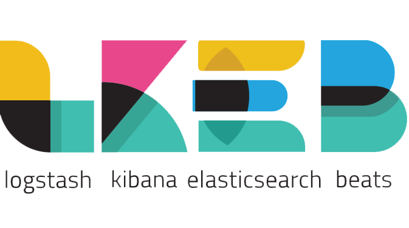

# Threat Hunting with a BELK stack

## What will you learn

* How to setup a threat hunting platform using the ELK stack 
* How to collect security events from different assets
* How to analyse them using Kibana
* How to create automatic rules on security incidents based on the MITRE ATT&CK framework
* How to alert and get more insights on the issue

## What will you need

* Docker (docker-compose) with 4GB of RAM
* An account on Slack 
* A Windows VM (we suggest Windows 10) 

## Run the stack

As we are using docker in this labs, to bring up and running the ELK stack and ElastAlter, you must run

`docker-compose build && docker-compose up`

from the root directory of the project. If everything ran correctly you should be able to reach:

* `http://localhost:5601` Kibana 
* `http://localhost:9200` ElasticSearch
* `http://localhost:3030` ElastAlert

More info: [https://1337.dcodx.com/workshops/workshop-threat-hunting-with-belk-stack](https://1337.dcodx.com/workshops/workshop-threat-hunting-with-belk-stack)